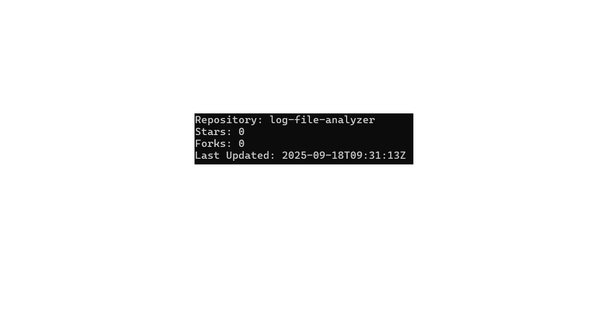

# GitHub API Dashboard

A small script that fetches repository details (stars, forks, last update) using the GitHub REST API.  
I built this to practice working with APIs and JSON responses.

## How to run
1. Clone repo
2. Install requests: `pip install requests`
3. Run: `python main.py`

## Example output

---

Still improving this — might extend it later to show contributors or issues.

---

👨‍💻 Author: **Raghav Yadav**  
📌 GitHub: [beingralph](https://github.com/beingralph)

---

Still improving this — might extend it later to show contributors or issues.
